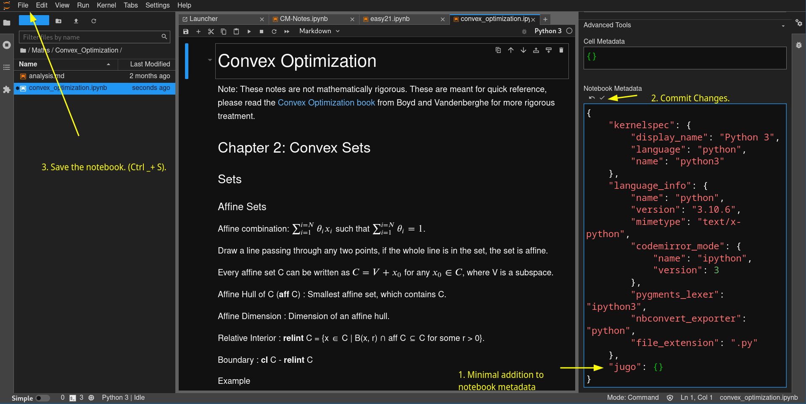

## Requirements
[Install nim](https://nim-lang.org/install.html). 

## Usage

Just add `"jugo": {}` into your notebook metadata. **not the cell metadata**.



Then run `nimble run -- /path/to/your/notebooks/ /path/to/your/hugo/content/`

Note: jugo is Work in Progress as of now, hence I have not published the package. You may be able to install WIP version as `nimble install https://github.com/DhruvPatel01/jugo` in which case you can simply run `jugo source_dir target_dir`.

jugo will walk the `/path/to/your/notebooks/` recursively. And for whichever notebooks it finds the above metadata, it creates a leaf bundle inside the location you gave.

So for example if I have 
- `/path/to/my/notebooks/analysis.ipynb` and
- `/path/to/my/notebooks/physics/cm.ipynb`

jugo will create 
- `/path/to/my/hugo/content/analysis/index.md` and
- `/path/to/my/notebooks/physics/cm/index.md`

You might want to add one more level like `/path/to/my/hugo/content/notes/analysis/index.md` in which case you should provide `/path/to/my/hugo/content/notes/` as your second argument. 

You can see the results produced by jugo on https://dhruvpatel.dev/notes/
The source notebooks are [here](https://github.com/DhruvPatel01/notebooks).
The generated markdown files are [here](https://github.com/DhruvPatel01/DhruvPatel01.github.io/tree/main/content/notes/)


## Custom Front Matter

By default jugo uses following defaults for front matter.
- `title`: File name (stripped of the extension, underscores are replaced by a space, no other character is removed.)
- `date`: File creation date from the notebook file
- `lastmod`: File modified date from the notebook file

If you want to override the defaults, or add anything else you can do so by providing such data in the "jugo" metadata of the notebook.
```json
"jugo": {
    "front_matter": {
        "title": "My Custom Title",
        "date" : "2042-01-01"
    } 
}
```


## Limitations

### Following are due to my laziness. 
I will definitely solve some of these issues.

- If any directory has a dot `.` in the name, e.g. `my.folder`, the directory in the generated tree will be renamed to `my`
- attached images are not copied. #TODO
- PNG generated from the notebook are transparent, which do not work proper for dark backgrounded themes.

### For following blame Hugo (or goldmark)
- You have to use `\ast` instead of `*` inside math (inline, or otherwise)


## TODO
- [x] add support for single file input.
- [x] support for images that are not outputs of execution.
- [x] single file output.
- [ ] Light background for images
- [ ] generating hierarchical list pages?
- [ ] Support for attached images in markdown.
- [ ] Support the dimensions of the PNG images.